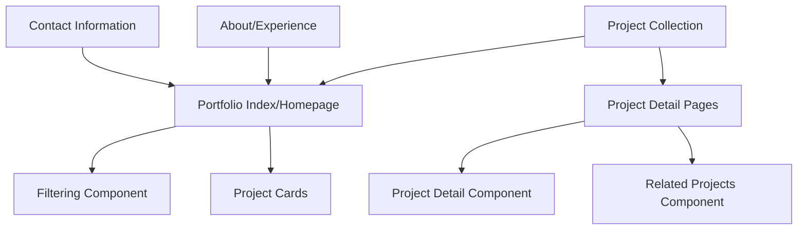

# Design Document: Project Portfolio

## Overview

The Project Portfolio will serve as the primary focus of Richard Baguley's website, transforming it from a blog-centric site to a professional portfolio that showcases his technical projects and experience. This document outlines the design approach for implementing this transformation within the existing Jekyll-based website.

The portfolio-focused site will feature a main portfolio page as the homepage (or prominent section), listing projects with filtering capabilities, and individual project detail pages that provide comprehensive information about each project. The design will maintain consistency with the existing Chirpy theme while prioritizing project presentation over blog content.

## Architecture

The Project Portfolio will become the central focus of the site, replacing the blog-centric approach. We'll leverage Jekyll's collection functionality to manage projects as a dedicated content type, and restructure the site navigation to emphasize the portfolio. This approach allows for:

1. Structured project data with consistent metadata
2. Automatic generation of project listing and detail pages
3. Integration with Jekyll's existing tag and category systems
4. Compatibility with the site's existing content workflow
5. Transformation of the site focus without requiring a complete rebuild

### High-Level Architecture



## Components and Interfaces

### 1. Project Collection

Projects will be managed as a Jekyll collection, similar to how posts and tabs are currently handled.

```yaml
# _config.yml addition
collections:
  projects:
    output: true
    sort_by: date
```

### 2. Portfolio as Homepage/Main Focus

The portfolio will become the main focus of the site, either replacing the homepage or becoming the most prominent section.

**Location Options:**
- Option 1: Replace `index.html` to make portfolio the homepage
- Option 2: Create `_tabs/portfolio.md` and update navigation to prioritize it

**Functionality:**
- Display project cards in a grid layout as the main content
- Provide filtering controls prominently at the top
- Include a brief professional introduction above the portfolio
- Support pagination if the number of projects grows large

### 3. Project Cards

Each project in the portfolio listing will be displayed as a card with key information.

**Design Elements:**
- Project title
- Brief description (truncated if necessary)
- Primary category/technology tags
- Featured image (if available)
- Visual indicator of project type

### 4. Filtering Component

A JavaScript-based filtering system will allow users to filter projects by category or technology.

**Functionality:**
- Filter by project category
- Filter by technology used
- Support for multiple simultaneous filters
- Visual feedback on active filters

### 5. Project Detail Page

Individual project pages will provide comprehensive information about each project.

**Layout:**
- Project header with title and key metadata
- Project description and background
- Challenges and solutions sections
- Technologies used (with icons)
- Outcomes and results
- Image gallery (if applicable)
- Related projects section

### 6. Related Projects Component

A component to display related projects based on shared categories or technologies.

**Functionality:**
- Display 2-3 related projects
- Base relationships on shared categories or technologies
- Provide direct links to related project pages

## Data Models

### Project Data Model

Each project will be defined as a Markdown file in the `_projects` directory with front matter for structured data:

```yaml
---
title: "Project Title"
date: YYYY-MM-DD
categories: [Primary Category, Secondary Category]
tags: [Technology1, Technology2, Technology3]
image: /assets/img/projects/project-image.jpg
project_type: [Client Project, Personal Project, Open Source]
role: "Principal Technical Architect"
duration: "Jan 2023 - June 2023"
links:
  github: https://github.com/username/repo
  demo: https://demo-link.com
  documentation: https://docs-link.com
featured: true
---
```

The content below the front matter will contain the detailed project description, challenges, solutions, and outcomes in Markdown format.

### Category and Tag Structure

Projects will use the same category and tag system as blog posts, but with a focus on:

**Categories:**
- Cloud Infrastructure
- DevOps
- Data Engineering
- Security
- Architecture

**Tags:**
- Specific technologies (AWS, Azure, Terraform, etc.)
- Methodologies (CI/CD, Infrastructure as Code, etc.)
- Domains (Government, Justice, etc.)

## Error Handling

1. **Missing Images:** If a project references an image that doesn't exist, a default placeholder image will be displayed.
2. **Filtering:** If no projects match the selected filters, a friendly "No projects found" message will be displayed.
3. **Related Projects:** If no related projects are found, this section will be hidden rather than showing empty.

## Testing Strategy

### Unit Testing

- Verify project collection configuration works correctly
- Test filtering component functionality
- Validate related projects algorithm

### Integration Testing

- Ensure portfolio integrates properly with the site navigation
- Verify navigation structure emphasizes the portfolio focus
- Test responsive design across different device sizes

### User Testing

- Verify portfolio is discoverable from main navigation
- Ensure project information is clearly presented
- Test filtering functionality from a user perspective
- Validate that project detail pages provide sufficient information

## Design Considerations

### Responsive Design

The portfolio will be fully responsive:
- Grid layout will adjust columns based on screen size
- Project cards will stack on mobile devices
- Filtering controls will adapt to smaller screens

### Performance

To ensure good performance:
- Project images will be optimized and served in appropriate sizes
- Filtering will be implemented client-side to avoid page reloads
- Lazy loading will be used for images below the fold

### Accessibility

The portfolio will follow accessibility best practices:
- All images will include alt text
- Color contrast will meet WCAG standards
- Filtering controls will be keyboard accessible
- Semantic HTML will be used throughout