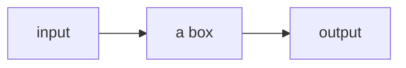

# This is CS50x - Introduction to Computer Science

📖 [eduX link course material](https://learning.edx.org/course/course-v1:HarvardX+CS50+X/block-v1:HarvardX+CS50+X+type@sequential+block@3c550787b1d1470bbdba91d14392bd43)

>
>  Goal is to get a better understanding of the fundermentals of programming.

## Week 0 Scratch

📝 [cs50.harvard.edu notes](https://cs50.harvard.edu/x/2022/notes/0/)

Computer science teachers you about thinking like a programer. 

Taking the problem or `input` and getting to the `output`

How do you get from the `000` to the objects moving on the screen of a phone.
Since computers run on electricity, which can be turned off and then on we just represent a bit by turning some switch on and off again to represent `0` or `1`.
Modern computers have billions of switches called transistors that can be turned off and on to represent different values. 

`000` = `0`
`001` = `1`
`010` = `2`
`011` = `3`
`100` = `4`
....
`111` = `7`

### Representing numbers in binary! 

To count people in a room we may use our fingers in a system call `unary`, where each digit represents a single value of one. 

To count higher we might need to use ten digits, 0 through to 9, with a system called `decimal`.

Computers use a simpler system called `binary` with just two digits 0 and 1.

| 4 | 2 | 1 | | |
| 0 | 0 | 0 | = | 0 |
| 0 | 0 | 1 | = | 1 |
| 0 | 1 | 0 | = | 2 |
| 0 | 1 | 1 | = | 3 |
| 1 | 0 | 0 | = | 4 |
| 1 | 0 | 1 | = | 5 |

Each binary digit is also called a `bit`
To count higher than 7 you need to  add another `bit` 
Most computers use `8 bits` at a time, like `00000011` for the number 3. 

And the pattern to count in binary with multiple bits is the same as the pattern in decimal with multiple digits.

For example, we know the following number in decimal represents one hundred and twenty-three.
`1 2 3`

The `3` is in the ones place, the `2` is in the tens place, and the `1` is in the hundreds place.
So `123` is `100×1 + 10×2 + 1×3 = 100 + 20 + 3 = 123`.

Each place for a digit represents a power of ten, since there are ten possible digits for each place. The rightmost place is for 100, the middle one 101, and the leftmost place 102:

10^2 | 10^1 | 10^0
1 |  2 |  3

### Text 

ASCI the or **American Standard Code for Information Interchange** is a chart to map characters to letters

When we receive a text message, we might be getting patterns of bits that have the decimal values `72`, `73`, and `33`. Those bits would map to the letters `HI!`. And the sequences of bits we receive would look like `01001000`, `01001001`, and `00100001`, with 8 bits for each character.

72 | 73 | 33 |
H | I | ! | 

With eight bits, or one byte, we can have 28, or 256 different values (including zero). (The highest value we can count up to would be 255.)

`A Byte = 8 Bits`

`Unicode` allows for `Emoji's` 🥳 

For example, the “face with medical mask” emoji is just the four bytes `11110000` `10011111` `10011000` `10110111`

This is then interpreted by your operating system hence the differences between `iOS` and `Android` 

### Colours and images, video and sound

| R | G | B |
| 72 | 73 | 74 |

Each number might be 8 bits, with 256 possible values, so with three bytes, or 24 bits, we can represent millions of colors. Our three bytes from above would represent a dark shade of yellow:

The dots, or squares, on our screens are called pixels, and images are made up of many thousands or millions of those pixels as well. So by using three bytes to represent the color for each pixel, we can create images. We can see pixels in an emoji if we zoom in. 

Videos are sequences of many images, changing multiple times a second to give us the appearance of motion, as a flipbook might.

Music can be represented as bits also, [MIDI](https://en.wikipedia.org/wiki/MIDI) Musical Instrument Digital Interface which represents music with numbers for each of the notes and their duration and volume.

All of these ideas are just `zeroes` and `ones` interpreted and used by your computers software.

 - There are other formats, some of which use compression (mathematical ways to represent some data with fewer bits), or some which might be containers that store multiple types of data together.
 - And since there are many companies and groups developing software, we have lots of different file formats in existence, each with their own ways of representing data. But there are also organizations that work on some consensus, like the one responsible for maintaining the Unicode standard.

### Algorithms 

